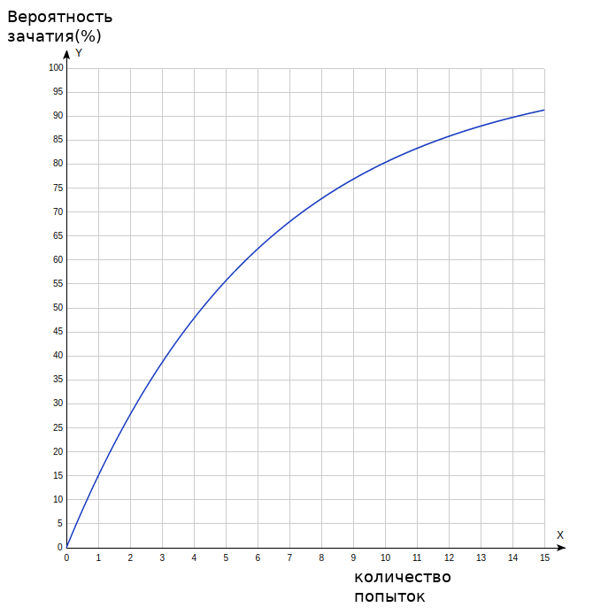
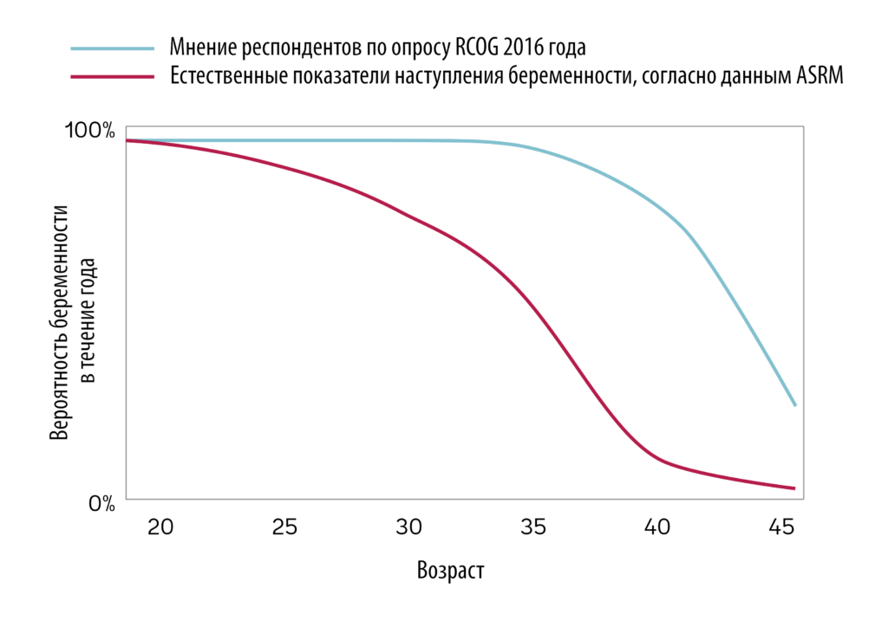

Итак, сегодня(16.07.2020) меня прямым текстом попросили собрать основные рабочие моменты в текст, поэтому появилась эта статья.

## Что такое ИИ?
Больше всего вопросов связаны с искусственной инсеминацией, несмотря на то, что весь гугл заполнен описаниями. Суть метода - я собираю эякулят в контейнер для анализов (большой, он же “для мочи”), а дальше после разжижения (подождать 15 мин) девушка шприцем без иглы (на 10 или хуже 5мл) помещает материал куда надо, более подробно можно почитать [на сайте репробанка](https://reprobank.ru/novosti/stati/domashnyaya-inseminatsiya-spermoj-donora) или в хорошем [бложике другого донора](https://spermsdonor.livejournal.com/2384.html).

## Почему я использую ИИ  
Потому что невозможно отслеживать здоровье девушки на протяжении всего периода сотрудничества, а это может быть и год и больше. Вряд ли кто-то согласится целый год по 7тр сдавать анализы перед встречей, а ситуация может поменяться очень быстро. У меня была ситуация, что с девушкой пытались естественным путем, но мне не понравились справки и я ждал карантин 2 месяца и сдавал анализы. Или просто мне принесли анализы с мелкими болячками. В этот момент я узнал, что ЗППП во время беременности не лечат, и они могут стать причиной большого количества проблем. Это решительно отбило у меня тягу к случайным связям в период когда делаешь детей.  
Помимо этого, секс на первом свидании с незнакомым человеком, у которого непонятно что в голове это достаточно нервное занятие.

## Где встречаемся
Я точно никого не приглашаю к себе, чтобы не светить адрес прописки, а в остальном выбор достаточно большой:
* почасовые отели - наиболее простой вариант , там ценник 1200-1800р за два часа, можно [вот здесь посмотреть](https://60minut.ru/);
* также есть почасовые квартиры на авито, там чуть дешевле и чуть грязнее;
* иногда приглашают просто к себе на квартиру, если девушке пофигу или квартира съемная;
* можно подъехать ко мне на район на машине, и я просто вынесу контейнер из дома, потом припарковаться где-то рядом и ввести;
* я могу подъехать на машине к тебе, припарковаться в незаметном месте и потом вынести контейнер, но машина у меня есть далеко не каждый день. Хотя можно взять каршеринг. Есть кстати в яндекс драйве минивэны, стоят 500р за 2 часа, +8 р за километр пути, этакая дешевая, анонимная и не очень чистая замена почасовому отелю, только надо матрас надувной купить.

Я могу выехать в соседний город, но в этом случае девушка организовывает мне жилье и оплачивает билеты на карту до того, как я выехал. Мне эта оплата нужна скорее чтобы уменьшить вероятность, что человек пропадет по приезду.

## Как определять овуляцию
По мере убывания надежности:  
**Фолликулометрия** - это узи за 700р, на котором тебе говорят размер главного фолликула, и когда он дорос до 18мм можно начинать попытки. Главное преимущество - ты знаешь сколько времени осталось до овуляции, можно предупредить донора, чтобы он начинал воздерживаться. Например спермограмму не делают, если воздержание было меньше 2-х дней, стандартом считается 3-4 дня, а максимум - 7 дней. Если слишком мало, то страдает объем и концентрация, если слишком много - то увеличивается процент неподвижных сперматозоидов. На самом деле даже 4 дня продержаться достаточно некомфортно, плюс застой в длительной перспективе грозит простатопатией. Ещё слышал версию, что если аппарат старый, с низким разрешением, а узист слеп, то он может не заметить фолликул и поставить "ановуляторный цикл". Может бред, не знаю, но лучше ходить к врачам, которым доверяешь и ещё можно перепроверять тестами.  
**Тесты** - стоят 500р за 5шт, работают, не надо ходить в клинику. Но не подскажут сколько осталось до нужного дня, поэтому возможно встретится с меньшим периодом воздержания.  
**Базальная температура** - бесплано, не удобно(это я слышал от практика), и измерения зависят от кривизны рук. То есть надо утром перед работой сидеть с градусником, и об овуляции ты узнаешь непосредственно в день когда она пришла.  
**По ощущениям** - не работает. Я оба раза так встречался на неделю раньше срока. Другая девушка сказала, что у нее эти ощущения приходят не вовремя. То есть ощущения есть, но они являются следствием какого-то другого процесса.  
**Календарь** - не работает. Ну не приходит овуляция в нужный день.  
На тему этих методов есть [просвещающее видео](https://www.youtube.com/watch?v=-C3ib1y_6bI&t=2s).

## Когда встречаемся  
Начинаем за день до овуляции и делаем 1-3 встречи с интервалом 1-2 дня, по ситуации и по желанию. Я работаю сейчас удаленно, сорваться могу в любой момент, но наиболее удобно вечером и поздним вечером.

## Про возможность пересечься с другой клиенткой  
Поначалу я пытался как-то разграничивать клиенток по времени, не набирать новых если уже кто-то есть на эту дату, но уже в течении нескольких циклов я понял что это не работает. Во первых у всех разная длительность цикла, и если в этом месяце всё ровно, то в следующем будет 3 человека в один день. Во вторых овуляция приходит с большим разбросом, в третьих половина клиенток просто не может прийти на встречу - кто-то заболел, у кого-то ановуляторный цикл, кто-то уехал отдыхать на море.
На самом деле даже если тесты сработают в один день, то можно просто сегодня съездить к одной а завтра к следующей, хотя для нее получится маленький период воздержания, всего день. Но так ещё ни разу не бывало, хотя бывали ситуации когда 3 человека обещали на один и тот же день - до этого месяц ни с кем не встречался, потом втроем на один день, как результат - сначала одна, через 4 дня другая, третья дала отбой.

## Про фейко-боязнь и созвоны
Эти группы просто сборник неадеквата - тебе постоянно пишут свингеры, куколды и разводилы. Разводилы очень любят скинуть фотку девушки покрасивее, упомянуть, что у них всё хорошо с деньгами и настаивать на естественном способе зачатия. Даже если фотку не нашел гугл, то есть вероятность, что им её скинула нормальная девушка, в переписке с другим аккаунтом. Поэтому доноров может раздражать, если просишь скинуть фоток побольше. Бывало кстати, что со мной переписывался женский аккаунт, а потом клиентка мне рассказывала, что ей с него предлагал услуги парень и скидывал фотки. Поэтому если скидываешь фотки, то лучше если на них будет бумажка с id страницы - и к тебе больше доверия, и использовать их никто не будет. Естественно так никто не делает, поэтому я просто созваниваюсь по вотсапу, и без этого созвона ни с кем сотрудничать не начинаю.  
Писать по объявлениям девушек очень быстро надоедает - большая часть просто не отвечает, ты не знаешь, реальный ли это человек.  
Вообще когда пишешь первый раз в идеале рассказать немного о себе, и сказать, когда будет встреча - это один из первых вопросов. И как определяешь нужный день.

## Можно ли встретится полностью анонимно?
Возможен вариант, что я вынесу контейнер из подъезда, а твой друг или подруга заберет и вы например в машине неподалеку введете. Но в любом случае я хочу предварительно созвониться, хоть на левый телефон того же друга, понять что за человек, какие риски меня ждут. Хотя так себе вариант.

## Есть опыт зачатия подобным образом?
Да. На данный момент было:
* Всего встреч: 14
* Удачных: 3
* Неудачных: 7
* Мимо овуляции: 3
* Жду результат: 1  
**Дата обновления:** 28.09.2020

## Зачем я это делаю
Это интересный кейс. Я читал раньше истории про доноров, но не особо верил, что это реально. Что находятся женщины, готовые родить от незнакомого человека без дальнейших претензий. Что есть парни, которые рискуют попасть на алименты до 75% дохода или быть обвиненным в изнасиловании с дальнейшим вымоганием денег и угрозой сесть лет на 6, самостоятельно предоставив генетические следы . И рискуют так далеко не один раз, этакое серийное самоубийство. Оказывается так же реально, как поход в репродуктивную клинику, а эти риски можно минимизировать. Потом пришла мысль, что ты последняя инстанция, куда обращаются девушки. Спорно конечно, можно накопить денег и пойти в клинику, но сколько попыток понадобится, и хватит ли денег до результата?

Сюда же можно добавить, что это определенная форма свободы - ты оставил потомство и можешь больше не переживать на эту тему. Тебе больше на надо искать мифическую "ту самую на всю жизнь" или терпеть ту, которая есть. Не нужно никого обеспечивать, бояться потерять надоевшую работу. Можно общаться с кем тебе нравится и пока это нравится, можно заниматься чем ты хочешь.

Я тут не ищу физическую близость - это проще делать на обычных сайтах знакомств.  
Я тут не ищу денег - обычная наемная работа программистом эффективнее.

## Правда бесплатно?
Обычно я прошу оплатить отель и дорогу, если они есть. Иногда оплачиваю сам. Есть девушка, которая по собственной инициативе платит за встречи. Несколько раз обещали заплатить за результат. Я сейчас наполовину ушел с предыдущей работы, а новую пока искать очень не хочу, поэтому сейчас стараюсь экономить.

## Вредные привычки? Аллергия? Наследственные заболевания?
* Раньше покуривал траву, раз в пару недель-месяцев. До лета 2018, потом времени не было, за 2 года уже всё выветрилось.  
* Был период когда активно посещал платных женщин. Потом появилась постоянная девушка и попросила так больше не делать. Проверился уже раза 4 с тех пор, последствий никаких. С феями в принципе трудно что-то подхватить, всё в резинке и без поцелуев.  
* Есть привычка давить черные точки на руках, выглядит как какое-то высыпание, но дерматолога не заинтересовало.  
* Алкоголь действительно не пью с 2010 года, табак действительно никогда не курил.

## Планируешь потом контактировать с детьми?
Хз, я бы не ставил на этот вариант. Ну может пару раз встретиться, показаться, что существую. Но активно участвовать в жизни семьи точно не буду. Хотя я слышал некоторые жалуются, что девушки пропадают по достижению результата, это по-моему тоже не правильно. Лучше оставаться на связи, и если что-то пошло не так, то иметь возможность предупредить остальных.

## Про подготовку к беременности
Минимум 30% девушек имеет репродуктивные проблемы, поэтому перед обращением к донору лучше сначала сходить к гинекологу и провести стандартные проверки при подготовке к беременности. Всё-равно ты их сделаешь после первой неудачной попытки. Это сэкономит время и тебе и донору, и в целом с подготовленным человеком приятнее работать. Ну и ту же фолиевую кислоту пить, это витаминки по 60р.

## Какая вероятность забеременеть
В [статье](https://reprobank.ru/novosti/stati/domashnyaya-inseminatsiya-spermoj-donora) репробанка было сказано “Внутривлагалищная инсеминация не отличается от естественного зачатия. Вероятность успеха составляет около 15%”, я им доверяю, т.к. официальная медицина. Используя универский курс теории вероятностей можно вычислить следующий график вероятности зачатия от количества попыток:

Также у репробанка есть [статья](https://reprobank.ru/novosti/stati/chasiki-tikayut ) о вероятности зачать с возрастом, оттуда можно взять этот график:

Периодически я слышу мнение, что вероятность у ИИ ниже чем у естественного, но не очень верю, что разница так существенна. Основной довод, что сперматозоиды не выдерживают термошока, поэтому прикреплю [исследование](files/18850.pdf) выживаемости сперматозоидов при разной температуре и [протокол](files/voz.pdf) проведения спермограммы по ВОЗ - заметь, это процедура измерения, она не должна искажать характеристики вроде процента подвижных сперматозоидов, и при этом они позволяют транспортировать материал в течении часа из дома, ждут разжижения и собирают ровно в такие же контейнеры.

## Техническая часть
Поскольку хорошие вещи не создаются с первой попытки, а я постепенно приобретаю новый опыт, то текст был сразу сделан в системе контроля версий **GIT**, в родной для него **markdown**-разметке. Историю изменений можно посмотреть на странице с [коммитами](https://github.com/spermdonors/texts/commits/master), а момент, когда и кем было изменен конкретный кусок текста можно посмотреть на странице [blame](https://github.com/spermdonors/texts/blame/master/questions.md).

